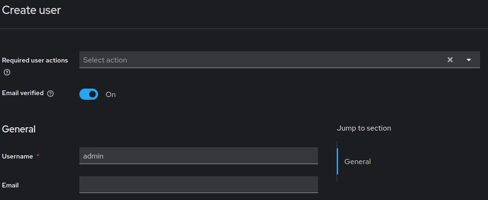
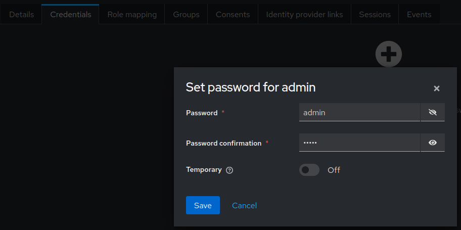

# Recipe-Repository

# About the project:

This project is a recipe repository where you can create, read, update and delete recipes.\
The project is built using Spring Boot, Spring Data JPA, PostgreSQL, Docker and Docker-compose.


# How to run the project:

## Requirements:

Java 21 or newer\
Maven 3.8.x or newer\
Docker 27.3.x or newer\
Docker-compose 2.29.x or newer

## Configuration:

The project is configured to run on port 8080.\
The database is configured to run on port 5432.\
All the configurations can be found in the application.properties file.\
The environment variables for db and app are set in .env file.

| Environment Variable | Description                        | Example                     |
|----------------------|------------------------------------|-----------------------------|
| DB_NAME              | The name of the database           | recipe_repository           |
| DB_USERNAME          | The username for the database      | recipe_repository_user      |
| DB_PASSWORD          | The password for the database      | password                    |
| TEST_USERNAME        | The username for the test database | recipe_repository_test_user |
| TEST_PASSWORD        | The password for the test database | password                    |

| Application Property                    | Description                            | Example                                     |
|-----------------------------------------|----------------------------------------|---------------------------------------------|
| server.port                             | The port for the application           | 8080                                        |
| spring.datasource.url                   | The url for the database               | jdbc:postgresql://db:5432/recipe_repository |
| spring.datasource.username              | The username for the database          | recipe_repository_user                      |
| spring.datasource.password              | The password for the database          | password                                    |
| spring.datasource.driver-class-name     | The driver class name for the database | org.postgresql.Driver                       |
| spring.jpa.hibernate.ddl-auto           | The ddl auto for the database          | update                                      |
| spring.jpa.properties.hibernate.dialect | The dialect for the database           | org.hibernate.dialect.PostgreSQLDialect     |
| spring.jpa.show-sql                     | Show the sql queries                   | true                                        |

## Steps:

* Build the project:
```
mvn clean package
```
 or to skip tests
```
mvn clean package -DskipTests
```    

* Run the project:
```
docker-compose up --build
```

* Then you can access the project at:
```http://localhost:8081/```
* And the Keycloak at:
```http://localhost:8080/```

* To run the migrations:

you need to fill the variable in flyway.conf file with the database name, username and password.\
just like the .properties file.\

then you can run the migrations using the following command:

```mvn flyway:migrate```


## How to connect to db using database client:

You can connect to the database using any database client like DBeaver, DataGrip, etc.
using the following configurations:

* Database Url: jdbc:postgresql://localhost:5432/ *Your database name from .env file*
* Username: *Your username from .env file*
* Password: *Your password from .env file*

then you can connect to the database.


## How to create a temporary user:
to create a temporary user you need open keycloak admin console at:
```http://localhost:8080/admin```
log into konsole using the credential in your .env file.\

in the reciperepositoryrealm you can create a new user by clicking on the users tab and then clicking on the add user button.\
then you can fill the form like follows:


then create a password for the user by clicking on the credentials tab 




## How to use the api:

to use the api first you need to login to the keycloak using the following credentials with the user you created above:


to the following endpoint:

```localhost:8080/realms/reciperepositoryrealm/protocol/openid-connect/token```

end fetch the token from the response.\
then you can use the token to access the api.\
only by adding Bearer token to the header of the request.


